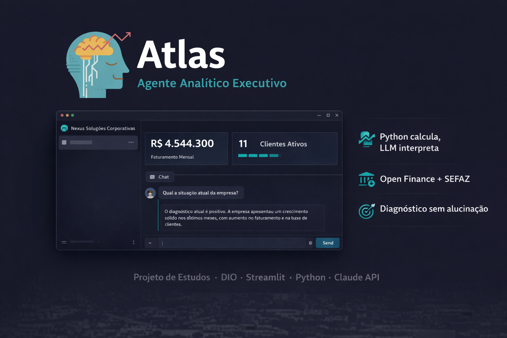
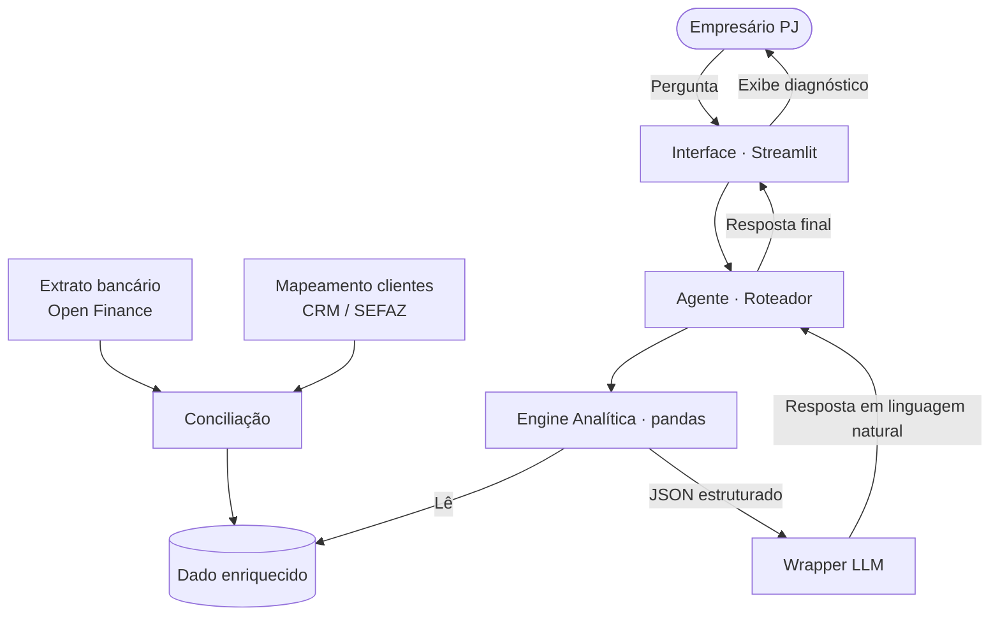

# Atlas — Agente Analítico Executivo

## Sobre este projeto

A maioria dos agentes financeiros com IA é construída para o cliente final — alertas de gasto, sugestões de investimento, chatbots de atendimento.

O Atlas parte de uma perspectiva diferente: **e se o agente fosse construído para o empresário cliente do banco?**

Diretores e gestores de pequenas e médias empresas vivem com dados fragmentados entre dashboards de marketing, vendas e operações. A análise depende de reuniões com múltiplos gerentes e interpretação manual de relatórios. O resultado são decisões lentas, baseadas em percepção — não em evidência.

O Atlas é um **analista executivo inteligente** que o banco oferece como serviço aos seus clientes PJ, respondendo perguntas estratégicas como:

- *"Qual a concentração de receita na minha carteira?"*
- *"Tenho problema de inadimplência?"*
- *"Qual canal traz mais resultado?"*

---

## Visão Estratégica

> Esta seção vai além do escopo do desafio técnico e representa a hipótese de valor do projeto.

Instituições financeiras competem hoje pela concentração de ativos de empresários e pequenas empresas. O argumento mais comum é taxa, produto ou relacionamento.

Existe uma alavanca pouco explorada: **inteligência analítica como serviço consultivo**.

Um empresário que recebe, via painel do seu banco, uma análise automática como *"61% da sua receita está concentrada em 3 clientes — isso representa risco de dependência"* percebe um valor que vai além do produto financeiro. Ele percebe um parceiro estratégico.

Isso cria um diferencial difícil de copiar: o banco passa a conhecer o negócio do cliente melhor do que qualquer concorrente, porque processa dados que o concorrente não tem acesso. A fidelização deixa de depender de taxa e passa a depender de inteligência.

O Atlas é uma prova de conceito dessa hipótese.

---

## Arquitetura



**Decisão central de arquitetura:** o LLM nunca realiza cálculos. Ele recebe um objeto JSON com resultados já processados pelo Python e os transforma em linguagem natural consultiva. Isso elimina a principal fonte de alucinações em agentes analíticos.

> Os arquivos CSV simulam o retorno de uma integração Open Finance (extrato bancário) com enriquecimento via CRM/SEFAZ. Numa implementação real, essa camada seria automatizada.

---

## Estrutura do Repositório

```
📁 dio-lab-atlas/
│
├── 📄 README.md
│
├── 📁 assets/
│   ├── banner.png
│   └── atlas-brain.svg
│
├── 📁 data/
│   ├── extrato_bancario.csv          # Simula retorno do Open Finance
│   ├── mapeamento_clientes.csv       # Simula enriquecimento CRM/SEFAZ
│   ├── historico_atendimento.csv
│   ├── perfil_empresa.json
│   └── produtos_financeiros.json
│
├── 📁 docs/
│   ├── 01-documentacao-agente.md     # Caso de uso, persona, arquitetura
│   ├── 02-base-conhecimento.md       # Estrutura dos dados e narrativa
│   └── 03-prompts.md                 # System prompt e exemplos de interação
│
└── 📁 src/
    ├── app.py                        # Interface Streamlit
    ├── agente.py                     # Engine analítica + wrapper LLM
    ├── conciliacao.py                # Camada de enriquecimento de dados
    ├── config.py                     # Configuração e variáveis de ambiente
    └── requirements.txt
```

---

## Entregas do Desafio

| Entrega | Status | Arquivo |
|---|---|---|
| Documentação do Agente | ✅ | [`docs/01-documentacao-agente.md`](./docs/01-documentacao-agente.md) |
| Base de Conhecimento | ✅ | [`docs/02-base-conhecimento.md`](./docs/02-base-conhecimento.md) |
| Prompts do Agente | ✅ | [`docs/03-prompts.md`](./docs/03-prompts.md) |
| Aplicação Funcional | ✅ | [`src/app.py`](./src/app.py) |

---

## Como Rodar

```bash
# Clone o repositório
git clone https://github.com/vitor-db/dio-lab-atlas.git
cd dio-lab-atlas

# Crie e ative o ambiente virtual
python -m venv .venv
.venv\Scripts\activate  # Windows
source .venv/bin/activate  # Linux/Mac

# Instale as dependências
pip install -r requirements.txt

# Configure a API key (opcional — sem ela roda em modo simulado)
cp .env.example .env

# Rode a aplicação
cd src
streamlit run app.py
```

> Sem API key configurada, o Atlas opera em **modo simulação** — cálculos reais via pandas, respostas geradas deterministicamente sem chamada ao LLM.

---

## Demo

🔗 [Acesse o Atlas no Streamlit Cloud](https://dio-atlas.streamlit.app/)

---

## Stack

| Camada | Tecnologia |
|---|---|
| Interface | Streamlit |
| Análise | Python 3.11+ · pandas |
| LLM | Claude API (com fallback simulado) |
| Dados | CSV + JSON (simulando Open Finance + SEFAZ) |
| Versionamento | Git + GitHub |

---

## Limitações do Escopo

- Dados simulados — sem integração com sistemas reais
- Não realiza análises contábeis ou fiscais
- Não calcula margem ou ROI sem dados de custo estruturados
- Não toma decisões — fornece diagnóstico para decisão humana

---

## Processo de Desenvolvimento

Este projeto foi desenvolvido em pair programming com **Claude (Anthropic)** como assistente técnico — desde a modelagem de dados e decisões arquiteturais até o código e a documentação. As escolhas estratégicas (reinterpretação do desafio, posicionamento B2B, arquitetura Open Finance + SEFAZ) partiram de discussão iterativa entre autor e assistente.

---

*Fork do desafio [DIO · Lab BIA do Futuro](https://github.com/digitalinnovationone/dio-lab-bia-do-futuro). Implementação própria com reinterpretação do caso de uso.*ks
