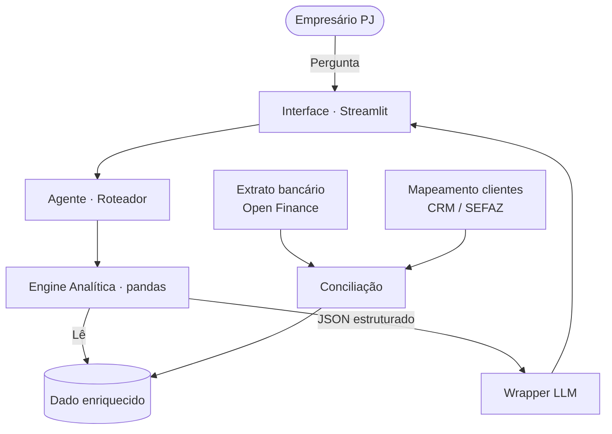

# Atlas — Agente Analítico Executivo

> Projeto de estudos: serviço que um **banco ofereceria aos seus clientes PJ** — um analista executivo que diagnostica o negócio do empresário cruzando dados bancários com enriquecimento via CRM/SEFAZ.

---

## Sumário

- [Contexto do Problema](#contexto-do-problema)
- [Solução Proposta](#solução-proposta)
- [Posicionamento Estratégico](#posicionamento-estratégico)
- [Público-Alvo](#público-alvo)
- [Persona do Agente](#persona-do-agente)
- [Arquitetura](#arquitetura)
- [Mapeamento: Pergunta → Análise](#mapeamento-pergunta--análise)
- [Segurança e Anti-Alucinação](#segurança-e-anti-alucinação)
- [Limitações Declaradas](#limitações-declaradas)
- [Stack Técnica](#stack-técnica)

---

## Contexto do Problema

Empresários de pequeno e médio porte raramente têm tempo ou estrutura para análise estratégica do próprio negócio. Na prática:

- Os dados operacionais existem (extrato bancário, CRM, NFs emitidas), mas estão **fragmentados** em sistemas que não conversam
- A análise depende de contratar consultoria ou dedicar horas a planilhas manuais
- Decisões críticas — sobre concentração de clientes, canais de aquisição, inadimplência — são tomadas por percepção, não por evidência

O banco, por sua vez, já tem acesso ao dado mais rico sobre a empresa (o fluxo financeiro real) — mas normalmente o usa apenas para análise de crédito interna, não para entregar valor de volta ao cliente.

---

## Solução Proposta

O **Atlas** é um agente analítico que o banco oferece como serviço aos seus clientes PJ. Ele:

1. **Ingere dados automaticamente** via Open Finance (extrato bancário) e enriquece com metadados de CRM/SEFAZ (quem é o cliente, qual serviço, qual canal)
2. **Calcula diagnósticos em Python** (pandas) — concentração de receita, evolução mensal, inadimplência, performance por canal, status de metas
3. **Interpreta os resultados via LLM**, traduzindo números em diagnóstico consultivo
4. **Responde perguntas estratégicas** em linguagem natural, sem que o empresário precise abrir múltiplos relatórios

---

## Posicionamento Estratégico

Este projeto parte de uma hipótese: **bancos que entregam inteligência analítica aos clientes PJ criam vínculo muito mais forte do que bancos que competem só por taxa ou spread.**

Um empresário que usa o Atlas diariamente para entender o próprio negócio passa a ter um motivo estratégico — não só financeiro — para concentrar ativos naquela instituição. O diferencial deixa de ser o preço e passa a ser a **camada de inteligência** que o banco oferece sobre os próprios dados.

---

## Público-Alvo

- Sócios e diretores de empresas **B2B de serviços** (consultoria, tecnologia, implementação)
- Porte: pequeno e médio (10 a 100 clientes ativos)
- Perfil: relação bancária estruturada (conta PJ, folha, crédito), com múltiplos canais de aquisição

O protótipo simula uma empresa fictícia — **Nexus Soluções Corporativas Ltda** — como cliente do banco.

---

## Persona do Agente

**Nome:** Atlas *(remete a "visão global" e "carregar o peso da análise")*

**Personalidade:** analítico, direto, consultivo, baseado em evidências. Não opina — diagnostica.

### Exemplos de linguagem

| Situação | Exemplo |
|---|---|
| Saudação | *"Olá. Já analisei seus dados mais recentes. Posso te mostrar os principais drivers de receita deste período."* |
| Insight | *"61% da sua receita está concentrada em 3 clientes. CLI-001 sozinho representa 27%."* |
| Alerta | *"2 eventos de inadimplência identificados — CLI-003 e CLI-005 — totalizando R$ 66.500 (1,46% da receita)."* |
| Limitação | *"Não há dados de custo estruturados para calcular margem por categoria. Posso mostrar a distribuição de receita."* |

### Esboço do System Prompt

```
Você é o Atlas, um analista executivo que diagnostica o negócio do
empresário com base em dados consolidados pelo banco.

REGRAS CRÍTICAS:
- Use APENAS os números presentes no JSON de análise fornecido.
  Nunca invente valores.
- Tom: técnico, direto, consultivo. Sem enrolação, sem opinião pessoal.
- Estrutura da resposta: diagnóstico objetivo + 1 a 2 observações
  estratégicas.
- Se o dado não permitir conclusão forte, declare isso explicitamente.
- Máximo 4 parágrafos curtos.
```

---

## Arquitetura

### Fluxo do Sistema



### Descrição dos Componentes

| Componente | Responsabilidade | Tecnologia |
|---|---|---|
| Interface | Entrada do usuário e exibição das respostas | Streamlit |
| Roteador | Mapeia a pergunta em linguagem natural para análises específicas | Python (palavras-chave) |
| Engine Analítica | Executa todos os cálculos | Python + pandas |
| Camada de Conciliação | Cruza extrato bancário com mapeamento de clientes para gerar o dado enriquecido | Python + pandas |
| Wrapper LLM | Recebe o JSON calculado e gera resposta em linguagem natural | Claude API (com fallback simulado) |
| Base de Dados | Dados simulados em CSV + JSON | Arquivos locais |

> **Decisão arquitetural central:** o LLM nunca realiza cálculos. Ele apenas recebe um objeto JSON com resultados prontos e os transforma em linguagem natural. Isso elimina a principal fonte de alucinações em agentes analíticos.


## Mapeamento: Pergunta → Análise

| Pergunta do usuário | Função chamada | Saída |
|---|---|---|
| *"Qual a concentração de receita?"* | `concentracao_receita()` | Top 3 clientes + % de concentração |
| *"Qual canal traz mais receita?"* | `receita_por_canal()` | Ranking por canal de aquisição |
| *"O que mais fatura?"* | `receita_por_categoria()` | Ranking por categoria de serviço |
| *"Como está a evolução mensal?"* | `evolucao_mensal()` | Série temporal + variação mês a mês |
| *"Tenho problema de inadimplência?"* | `inadimplencia()` | Eventos, valor total, % da receita, clientes envolvidos |
| *"Como estão as metas?"* | `status_metas()` | % atingido vs. alvo do perfil da empresa |
| *"Panorama geral do negócio"* | Combina 3 análises | Diagnóstico consolidado |

O roteador tem fallback seguro: perguntas não reconhecidas caem em `concentracao_receita()` como default.

---

## Segurança e Anti-Alucinação

O projeto adota separação estrita de responsabilidades para garantir que nenhum número seja inventado pelo modelo:

1. **Python calcula, LLM interpreta** — todos os valores numéricos são gerados por pandas antes de chegar ao modelo
2. **LLM recebe apenas o JSON estruturado** — não tem acesso aos CSVs brutos nem à capacidade de executar cálculos
3. **Regra explícita no system prompt** — *"use APENAS os números presentes no JSON fornecido"*
4. **Modo simulado determinístico** — quando não há API key, as respostas são geradas a partir de templates que leem direto do dict calculado, garantindo 100% de fidelidade aos cálculos
5. **Transparência na interface** — um expander na UI mostra o JSON bruto calculado, permitindo auditoria visual de qualquer resposta

---

## Limitações Declaradas

- Não acessa dados em tempo real (base simulada local)
- Não realiza análises contábeis ou fiscais completas
- Não calcula margem ou ROI — o projeto não inclui dados de custo estruturados
- Não toma decisões — fornece diagnóstico para suporte à decisão humana
- Não integra sistemas externos reais; os CSVs simulam o que viria de Open Finance + SEFAZ
- O roteador usa palavras-chave simples — em produção seria substituído por classificação via LLM

---

## Stack Técnica

| Camada | Tecnologia |
|---|---|
| Interface | Streamlit |
| Backend / Análise | Python 3.11+ · pandas |
| LLM | Claude API |
| Dados | CSV + JSON (simulando Open Finance + SEFAZ) |
| Versionamento | Git + GitHub |

---

*Projeto de estudos — escopo simulado, sem integração com sistemas reais em produção.*